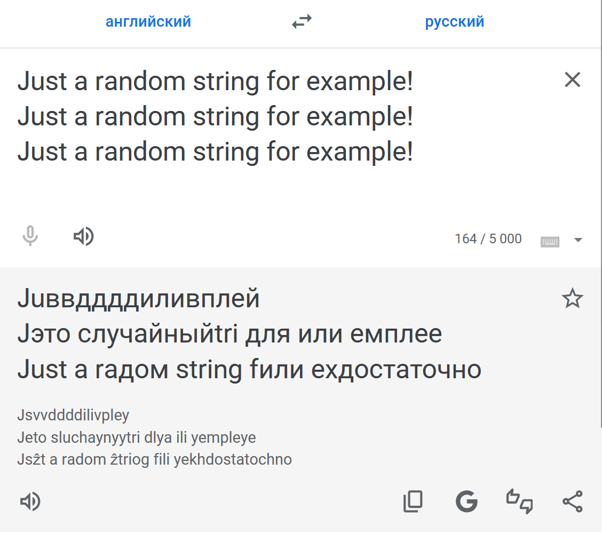

# homoglyph / homoglitch

CLI tools to make text human-readable but machine-hostile.

They replace characters with visually identical or similar Unicode
[homoglyphs](https://en.wikipedia.org/wiki/Homoglyph) and optionally
inject zero-width spaces to break indexing, searching, and translation.

## homoglyph example

Each time you get a new unique line with `homoglyph`

```bash
# run 3 times
echo 'Just a random string for example!' | homoglyph
Ϳս​​ѕt а r​​​а​​​​ոԁom ѕt​ri​​ոg f​​or ех​аm​​​plеǃ
Ϳ​​ս​​​ѕt а rаո​​ԁom ѕ​​​​​​tr​​​iոg f​or ех​​​аm​plеǃ
Ϳս​ѕt а r​​​​​​​аոԁom ѕ​tr​​​​​iոg f​​​or е​​х​​​​аmplеǃ
```

Which a machine won't always be able to recognize



A string of different length with a different set and number of characters
is always generated

```bash
for _ in {0..10}; do 
  echo 'Just a random string for example!' | ./homoglitch | wc -c | tr -d '\n'
  printf ' '
done

169 186 156 194 164 174 166 189 156 169 161

echo 'Just a random string for example!' | wc -c
34
```

## homoglitch example

But if the result is not good enough, there is a more hardcore
solution `homoglitch`

```bash
# run 3 times
echo 'Just a random string for example!' | homoglitch
Ϳ​​​​​​𝓾𝑠𝒕 ɑ 𝘳​𝚊​​​𝒏​​​ꓒ𝗢ｍ 𝐬𝕥​​​ꭈ𝑙𝑛𝗴 𝕗​​​ﮨ𝗋 𝓮​ｘ​𝒂​​ｍ⍴іⅇǃ
𝗝​​ꭒ​ƽ𝘵 𝖺 𝕣​​​𝛼​​𝖓𝓭​𑣗ｍ 𝐬​​𝓽​𝗋𝚒ռ𝑔 ẝ​𝛐𝐫 е​​​​​​​​​​𝔁​​​аｍ𝞀𝙡𝐞ⵑ
ꓙ​​​𝑢​𝐬𝔱 𝛂 ᴦ𝖺​​​​​​𝗇ⅾ૦ｍ 𝖘​𝖙​​𝚛⏽ո𝖌 ẝ​​​𐐬𝓇 𝙚​⤫ɑｍ𝝔​​𝚕ｅ！
```

## Build

First, generate `homoglyphs.go` from a homoglyph set:

### homoglyph

```bash
# For a visually invisible replacement
rm homo*.go
go run generate.go glyph.txt
CGO_ENABLED=0 go build -o homoglyph.exe -ldflags "-s -w" -trimpath -gcflags=all="-N -l" ./...
rm homoglyph.go
# or
./build.sh glyph.txt
```

### homoglitch

```bash
# For aggressive chaotic substitution
rm homo*.go
go run generate.go glitch.txt
CGO_ENABLED=0 go build -o homoglitch.exe -ldflags "-s -w" -trimpath -gcflags=all="-N -l" ./...
rm homoglitch.go
# or
./build.sh glitch.txt
```

The glitch.txt file is based on
[codebox/homoglyph](http://github.com/codebox/homoglyph).
